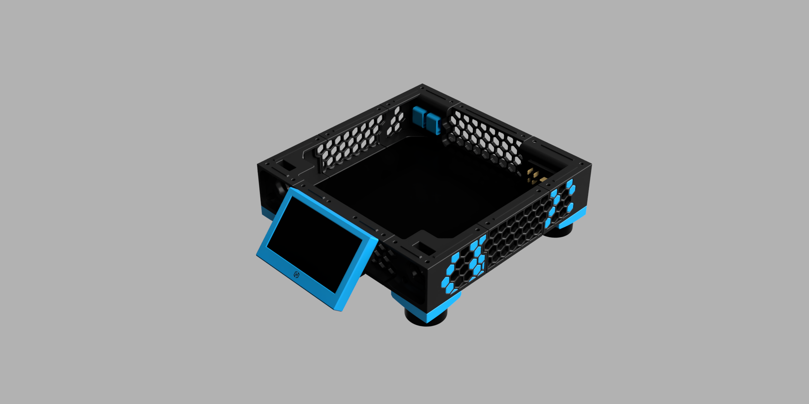

# ⬢ Alternate Skirt ⬢

This mod is a overhaul of the lower skirt . It is designed for users who want a more "industrial" look, better stability, larger display support and want to reuse the stock bottom panel from a v0.2.

## Key Features

Covered AC inlet: Safety.
 
Big Screen Support: Integrated mount for the Waveshare 4.3" DSI touchscreen.

Dual Keystone Ports: Support for 2x Keystone jacks (e.g., Ethernet, USB) in the rear corner skirt.

Trident-Style Stance: Compatible with V2.4/Trident style feet (Guitar Amp feet) for a more stable footprint.

Panel Compatible: Designed to work with the Stock V0.2 Bottom Panel.

More Hexagons? I havent counted.

## Mod Guide
Changed Parts

This mod replaces every part below the frame(except the rear motor mount). You will need to print the full set of front, side, rear skirts and corners provided in this repository.
The front accent piece of the skirt just snaps onto the screen.

## Bill of Materials (BOM)
To complete this mod, you will typically need:

Feet: 4x V2.4-style Rubber Feet (Guitar Amplifier style).

Screen: 1x Waveshare 4.3" DSI LCD.

Additional Hardware: 8 M3x10 Screws ,4 M5x(15~18) Screws 4 M5 Nuts 

M3 Heatset Inserts (Voron standard).

Optional Configurations
Foot Preference: If you prefer the original V0.2 look, you can still use the Stock V0.2 Feet. If doing so, do not print the "Foot Trim" pieces, as these are specifically designed to adapt the larger V2.4/Trident feet.

## Future Roadmap
Alternative Screen Mounts: Support for other Screens

Integrated Skirt Fans?

